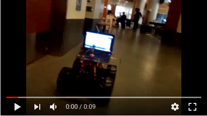
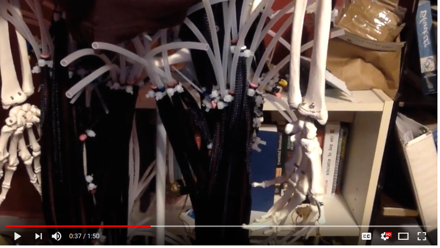
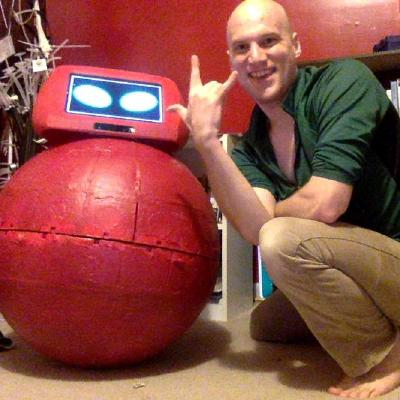
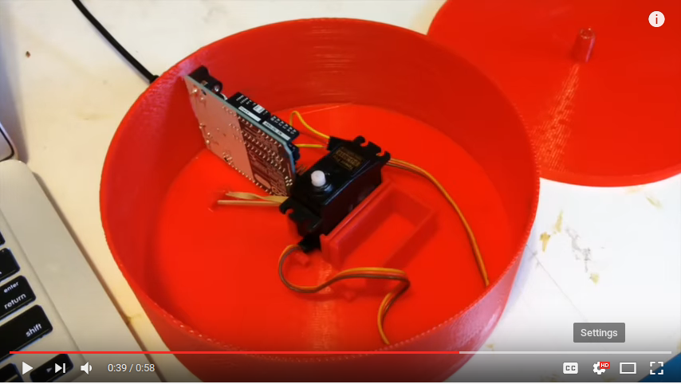
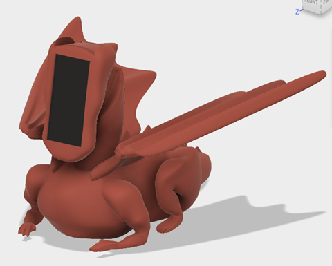

## What is edencybernetics.life?

The main goal of Eden Cybernetics is to use cybernetic organisms I call "daemons" to improve life for earthlings (and future Martians, Elon willing).

## Current/Future Projects

* Augment myself using AI and teach others how to do the same.
* Build a framework for people to easily build custom robots for themselves.
* Improve agriculture on Earth with gardens worked by robots.
* Start agriculture on Mars using robots
* Build a really awesome cybernetics YouTube channel

## Product/Project History

### Telepresence Bot (Fall 2014)

### Humanoid Skeleton with Pneumatic Muscles (Spring 2015)

### BB8 (Fall 2015 - Spring 2016)

I wanted to build a BB8 for the first new Starwars Launch. The build was behind schedule, over budget, and the head kept falling of. It was very educational and fun though!

### AI Daemon (Summer/Fall 2016)

Eventually, the AI personality became divorced from the BB8 robot itself and the project took on a life of its own and I had launched a kickstarter for the project.

### A Follow Me Camera Bot (Spring 2017)

I developed a very simple robot with a single axis of rotation that can make a laptop with a webcam follow a person when they move out of frame (left or right)

I put that project blueprints and code up on my website and sold a few copies!

### The Dragon Robot (Summer 2017)

This was an experiment to see how far I could take my design skills.

I added a smart phone to the face and used it to get the robot to talk and control the Bluetooth motor drivers in the neck.

### The spider bot (Summer 2017)

I began work on a spider robot, but it was too complex and became a dead end.

<blockquote class="twitter-video" data-lang="en">
Added a structure sensor to the spider. <a href="https://t.co/TJKRoZoDmp">pic.twitter.com/TJKRoZoDmp</a>
&mdash; Collin Bell ⓥ/⚛/Ƀ (@SlightlyCyborg) <a href="https://twitter.com/SlightlyCyborg/status/875280630225002496">June 15, 2017</a></blockquote>

### The IndieGoGo Launch. (Summer 2017)

On July 14, 2017 I had my first significant entrepreneurial success. I built motor mount that can move around the popular Structure Sensor on a 2d axis.

<iframe width="560" height="315" src="https://www.youtube.com/embed/ptE-CMaljYE" frameborder="0" allowfullscreen></iframe>

The launch netted me $228 in revenue, $96 of which is in donations for open sourcing the project. 

2 people bought the product.

The structure sensor costs > $300. This means that I could only market the device to people who already owned the structure sensor.

### The TY Beanie Baby Robot. (Summer 2017)

<blockquote class="twitter-video" data-lang="en">
Too damn cute <a href="https://t.co/w47LxJc6CQ">pic.twitter.com/w47LxJc6CQ</a>
&mdash; Collin Bell ⓥ/⚛/Ƀ (@SlightlyCyborg) <a href="https://twitter.com/SlightlyCyborg/status/886793968872288260">July 17, 2017</a></blockquote>

This robot got >3000 upvotes on [reddit](https://www.reddit.com/r/shittyrobots/comments/6pokmo/i_turned_a_1997_ty_beanie_baby_into_a_shitty_robot/)

